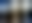
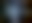

# ThumbHashCSharp

这是一个 ThumbHash 的 C# 实现。ThumbHash 是一种生成图像缩略图（通常使用base64存储）的算法，具体原理见：[ThumbHash 原理](https://evanw.github.io/thumbhash/#:~:text=ThumbHash%20generates%20an%20image)。
这个算法很适合用来制作图片加载的占位符

## 安装

你可以通过 NuGet 安装 ThumbHashSharp：

```bash
dotnet add package ThumbHashSharp
```

## 使用方法

以下是如何使用 ThumbHashSharp 的一些示例：

```csharp
using ThumbHashSharp;

// 将 RGBA 图像编码为 ThumbHash
int width = 100;
int height = 100;
ReadOnlySpan<byte> rgba = ...; // 你的 RGBA 数据
string thumbHashBase64 = ThumbHashHelper.RgbaToThumbHashBase64(width, height, rgba);

// 将 ThumbHash 解码为 RGBA 图像
Image image = ThumbHashHelper.ThumbHashToRgba(thumbHashBase64);

// 从 ThumbHash 中提取平均颜色
RGBA averageColor = ThumbHashHelper.ThumbHashToAverageRgba(thumbHashBase64);

// 提取原始图像的近似宽高比
float aspectRatio = ThumbHashHelper.ThumbHashToApproximateAspectRatio(thumbHashBase64);
```

## 示例

以下是几个图片前后的效果展示：

### 示例 1
<div align = "center">    


<br>
  png图片
</div>

### 示例 2
<div align = "center">    


<br>
  jpg图片
</div>

### 示例 3
<div align = "center">    


<br>
  webp图片(因为webp图片的解码问题预览图保存为webp放大效果有问题，保存为其他格式会好一些）
</div>


### 示例 4
<div align = "center">    


<br>
  avif图片
</div>

